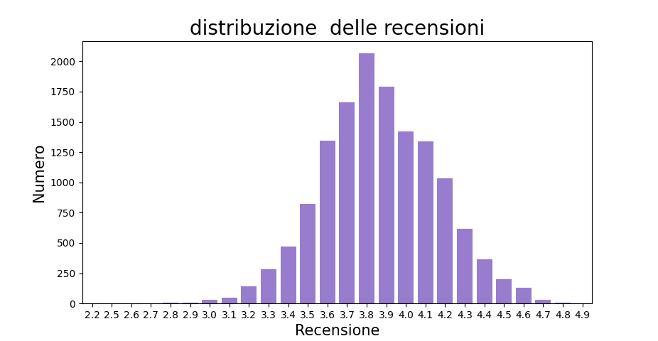
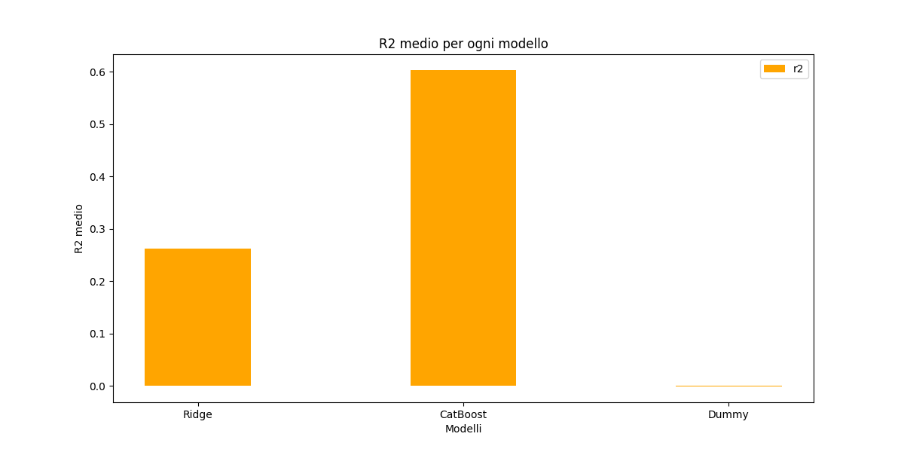

## 1. Introduzione

L'obbiettivo di questo progetto è quello di effetuare uno studio sulle valutazione dei vini, per capire quali caratteristiche (feature) del prodotto sono quelle piu apprezzati dai critici.

Inoltre il sistema ha l'obbiettivo di poter fornire un plausibile ranking anche a vini senza o poche recensioni dato che come in molti settori, c'è un problema con la distribuzione delle recensioni, dato che gli acquirenti tendono a non acquistare vini con poche recensioni, e dato che pochi acquirenti acquistano quel vino, quel vino continuerà ad avere poche recensioni, quindi il poter dare un rating iniziale plausibile permetterebbe di convincere più consumatori a provare quel vino.  

### 1.1. Elenco argomenti di interesse

- Ontologie e condivisione della conoscenza: utilizzo di ontologie per attribuire la semantica ai dataset, rappresentazione con RDF/XML ed integrazioni dati con SPARQL(Web semantico).
- Apprendimento supervisionato
- Ragionamento probabilistico e Bayesian Network: Apprendimento della Struttura,Dati mancanti

### 1.2. Requisiti funzionali

## 2. Creazione Dataset e Semantica

Il dataset iniziale l'ho trovato su [Kaggle](https://www.kaggle.com/datasets/budnyak/wine-rating-and-price/data). Tuttavia, ho ritenuto che questo dataset non fosse sufficiente poiché mancava un'informazione che considero importante: la varietà di uva  utilizzata.

Per colmare questa lacuna, ho applicato i concetti di condivisione della conoscenza per integrare il dataset.

Ho definito un ontologia così da poter piu facilmente recuperare questa informazione da Wikipedia, tramite l'utilizzo di [DBpedia](https://www.dbpedia.org/) infatti ho potuto recuperare le tipologie di uva usata nei vini, ed in quale vino sono utilizzate

Alla fine della manipolazione queste sono le informazioni riguardante al dataset utilizzato nel apprendimento supervisionato e nel ragionamento probabilistico

```bash
Index: 5768 entries, 4 to 13816
Data columns (total 9 columns):
#   Column           Non-Null Count  Dtype
---  ------           --------------  -----
 0   Country          5768 non-null   object
 1   Region           5768 non-null   object
 2   Winery           5768 non-null   object
 3   Rating           5768 non-null   float64
 4   NumberOfRatings  5768 non-null   int64
 5   Price            5768 non-null   float64
 6   Year             5768 non-null   int64
 7   WineCategory     5768 non-null   object
 8   Grapes           5768 non-null   object
dtypes: float64(2), int64(2), object(5)
```

- **Country**: Il paese in cui il vino è prodotto.
- **Region**: La regione specifica all'interno del paese in cui il vino è prodotto.
- **Winery**: Il nome della cantina che produce il vino.
- **Rating**: La valutazione media data al vino dai critici.
- **NumberOfRatings**: Il numero totale di voti che il vino ha ricevuto.
- **Price**: Il prezzo del vino.
- **Year**: L'anno in cui il vino è stato prodotto, alcuni vini sono composti da più annate ed erano indicati con N.V, è stata sostituita quella dicitura con un valore non compreso nel dataset '2025'.
- **CategoriaVino**: La categoria o tipo di vino (es. rosso, bianco, spumante).
- **Uve**: La varietà di uve utilizzate per produrre il vino.

### 2.1. Ontologie

Le ontologie sono strumenti fondamentali per la rappresentazione della conoscenza in modo strutturato e condivisibile. Esse permettono di definire un vocabolario comune per descrivere i concetti e le relazioni all'interno di un dominio specifico. Le ontologie facilitano l'integrazione e l'interoperabilità dei dati provenienti da diverse fonti, migliorando la comprensione e l'analisi delle informazioni.

Per la definizione dell'ontologia ho usato la libreria Owlready2


La rappresentazione grafica è stata creata tramite <https://service.tib.eu/webvowl/>[^1]

### 2.2. RDF (Resource Description Framework)

RDF è uno standard per la rappresentazione dei dati sul web. Utilizza una struttura a grafo per descrivere le risorse e le loro relazioni. Ogni tripla RDF è composta da un soggetto, un predicato e un oggetto (individuo-proprietà-valore). RDF è flessibile e può essere utilizzato per rappresentare qualsiasi tipo di informazione.

piu specificamente nel progetto ho usato RDF/XML che  è una sintassi per serializzare i dati RDF in formato XML. Questo formato combina la flessibilità di RDF con la struttura gerarchica di XML, rendendo i dati facilmente leggibili e processabili sia da esseri umani che da macchine. RDF/XML è il formato standard usato da Owlready2.

La rappresentazione rdf/xml dell' ontologia è disponibile nel file [mioVinoIndividui.rdf](mioVinoIndividui.rdf), nel file [mioVino.rdf](mioVino.rdf) invece sono stati omessi gli indivdui.

### 2.3. SPARQL

SPARQL è un linguaggio di query per interrogare i dati RDF. Consente di estrarre e manipolare le informazioni contenute nei grafi RDF utilizzando una sintassi simile a SQL, SPARQL infatti supporta operazioni di selezione, proiezione, unione e filtro, permettendo di eseguire query complesse sui dati semantici.

un esempio di query usata per recuperare tutte le varietà di uva usate per produrre vino

```sql
PREFIX dbo: <http://dbpedia.org/ontology/>
PREFIX rdfs: <http://www.w3.org/2000/01/rdf-schema#>
PREFIX dbr: <http://dbpedia.org/resource/>

SELECT ?grapeVariety  ?species 
WHERE {
 
  VALUES ?species {
    dbr:Vitis_vinifera
    dbr:Vitis_labrusca
    dbr:Vitis_riparia
    dbr:Vitis_mustangensis
    dbr:Vitis_aestivalis
    dbr:Vitis_rupestris
    dbr:Vitis_rotundifolia
    dbr:Vinifera_hybrids
  }

  ?grapeVariety dbo:species ?species ;
                rdfs:label ?label .
  
  # Filter English labels
  FILTER(LANG(?label) = "en")
}
```

## 3. Apprendimento supervisionato

L'apprendimento supervisionato è una tecnica di machine learning in cui un modello viene addestrato su un dataset  separato in feature di input e feature obiettivo (target).
Questo significa che ogni esempio di addestramento è associato a una risposta corretta. L'obiettivo del modello è imparare a mappare gli input alle etichette corrette in modo da poter fare previsioni accurate su nuovi dati non visti.

Le principali applicazioni dell'apprendimento supervisionato includono

- **regressione**
- la classificazione
- relazionale
- strutturale

Dato che il nostro obbiettivo è trovare un predittore per il Target 'Rating', che è un valore continuo è un problema di regressione.



Sembra seguire una Distribuzione normale quindi non c'è bisogno di applicare tecniche di oversampling.

i modelli che ho considerato sono

- Regressore Lineare con Regolarizzatore Ridge
- Catboost

### 3.1. Scelta degli iper-parametri

Gli iper-parametri sono i parametri di un modello di apprendimento automatico, i
quali non vengono appresi durante la fase di addestramento come i normali parametri
del modello (es. i pesi di una funzione lineare) ma devono essere necessariamente
fissati prima che il modello possa cominciare l’addestramento. La loro scelta influisce
sulle prestazioni e sulla complessità del modello. Uno dei compiti più complessi è
proprio la scelta degli iper-parametri per i vari modelli.
Per la scelta degli iper-parametri ho utilizzato una tecnica di K-Fold Cross Validation
(CV).
Nella K-Fold CV il dataset viene diviso in k fold (insiemi disgiunti) e il modello viene
addestrato k volte. Per ogni iterazione 1 fold viene usato per il testing mentre gli altri
k-1 fold vengono utilizzati per il training. In questo modo è possibile testare e
addestrare il modello su dati diversi per comprendere “la bontà” del modello.
La strategia che ho deciso di applicare per ricercare gli iper-parametri dei miei modelli
è la GridSearch con Cross Validation. In questo approccio vengono definite le griglie
dei valori possibili per gli iper-parametri e si esplorano tutte le combinazioni possibili
alla ricerca della miglior combinazione possibile.

### 3.2. Iper-parametri dei modelli

#### 3.2.1. Ridge Regressor

- **alpha**: Parametro di regolarizzazione. Maggiore è il valore di alpha, più forte è la regolarizzazione.
- **solver**: Algoritmo utilizzato per calcolare le soluzioni. Può essere 'auto', 'svd', 'cholesky', 'lsqr', 'sparse_cg', 'sag', 'saga'.

#### 3.2.2. CatBoost

CatBoost è algoritmo basato su gradient boosting su alberi decisionali.

- **iterations**: Numero massimo di alberi da addestrare.
- **depth**: Profondità massima degli alberi.
- **learning_rate**: Tasso di apprendimento.
- **l2_leaf_reg**: Coefficiente di regolarizzazione L2.

Iper-parametri ottimali restituiti da GridSearch con Cross Validation

| Modello    | Parametro            | Valore  |
|------------|----------------------|---------|
| Ridge      | alpha                | 10      |
| Ridge      | solver               | auto    |
| CatBoost   | iterations           | 300     |
| CatBoost   | depth                | 6       |
| CatBoost   | learning_rate        | 0.1     |
| CatBoost   | l2_leaf_reg          | 3       |

### 3.3. Valutazione delle performance

Per valutare le performance dei modelli, sono state utilizzate due metriche principali:

- **RMSE (Root Mean Squared Error)**: Questa metrica misura la differenza tra i valori previsti dal modello e i valori effettivi. Un valore di RMSE più basso indica una migliore accuratezza del modello.
- **R2 (R-squared)**: Questa metrica rappresenta la proporzione della varianza nel valore di output che è prevedibile dalle feature di input. Un valore di R2 più alto indica una migliore capacità del modello di spiegare la variabilità dei dati.

Le performance dei modelli sono state confrontate utilizzando queste metriche per determinare quale modello fornisce le previsioni più accurate.

per confronto è stato aggiunto anche una baseline (indicato con dummy nei grafici) che ottimizasse la loss quadratica media.




### 3.4. Curve di apprendimento


Forma della curva strana delle possibili spiegazioni potrebbero essere

- Problemi nella rappresentazioni dei dati
  - Possibilmente usando un encoder diverso si avrebbero avuti risultati migliori
- Range dei valori numerici
  - Si potrebbe effetuare una normalizzazione dei range
- No Free Lunch Theory
  - Nessun modello di machine learning è universalmente migliore di un altro per tutti i problemi. La performance di un modello dipende dal problema specifico e dai dati utilizzati.[^2]


Forma della curva regolare

### 3.5. Analisi dei risultati dei modelli

Entrambi i modelli hanno ottenuto risultati migliori della baseline, ma il modello basato su alberi decisionali ha ottenuto risultati nettamente migliori.

Un valore ottimale di *R2* sarebbe un valore  vicino ad 1, A seconda del contesto diversi valori di *R2* sono considerati accettabili. Dato che il dominio che stiamo analizzando è influenzato dal comportamento umano  entrambi i modelli hanno ottenuto un risultato discreto.

L'aggiunta di nuovi esempi e di feature non ancora considerate possono aumentare l'efficacia di entrambi i modelli

## 4. Ragionamento probabilistico e Bayesian Network

Il ragionamento probabilistico si basa sulla teoria delle probabilità e consente di fare inferenze su eventi incerti utilizzando distribuzioni di probabilità.

Una delle strutture più comuni per il ragionamento probabilistico è la rete bayesiana. Una rete bayesiana è un modello grafico che rappresenta un insieme di variabili e le loro dipendenze condizionali tramite un grafo aciclico diretto (DAG). Ogni nodo del grafo rappresenta una variabile, mentre gli archi rappresentano le dipendenze probabilistiche tra le variabili.

Nelle reti bayesiane, la capacità di gestire dati mancanti è una delle caratteristiche fondamentali. Grazie alle distribuzioni di probabilità condizionate, anche se alcune variabili non sono note, la rete può comunque inferire valori plausibili per la variabile di interesse basandosi sulle dipendenze note e sulle informazioni disponibili.

### Struttura rete bayesiana

Ho provato vari algoritmi di apprendimento della struttura ma:

- *HillClimbSearch*
  - Dato il range dei valori numeri e la sparisità dei valori, anche dopo l'applicazione di una tecnica di binning non è stato possibile applicare l'algoritmo per enorme necessità di memoria
- *ExhaustiveSearch*
  - 
  - Tempo computazionale non accettabile
- *TreeSearch*
  - 

Quindi Ho deciso allora di fornire una struttura arbitraria alla rete bayesiana.


## Sviluppi Futuri

Un possibile sviluppo consiste nell'allineare l'ontologia Top-level esistenti per facilitare un'ulteriore espansione.

In questo modo si potranno integrare informazioni quali la composizione del suolo nelle diverse regioni, le specifiche tecniche delle uve (acidità, tipologia di buccia, ecc.) e altri fattori che influenzano la qualità del vino. Ciò consentirebbe di estendere il dataset con dati più completi, migliorando le analisi sia in ambito di apprendimento supervisionato sia nelle procedure di inferenza probabilistica.

## 5. Rifermenti Bibliografici

::: {#refs}
:::

[^1]: @Lohmann2014WebVOWLWV
[^2]: @10.1162/neco.1996.8.7.1341
